# Phase 2 Database Audit: Inventory, Schema Architecture & Integrity

> **Document Status:** Complete Audit Report  
> **Environment:** Live MySQL 9.4 / PHP 8.2 (`unified_pos` database)  
> **Audit Type:** Read-Only Schema & Implementation Audit  
> **Date:** October 9, 2026  
> **Codebase Target:** `qynova_e-commerce` (Backend `backend/src/` & Database `database/`)  

---

## 1. Executive Summary

This audit provides a comprehensive, verified inventory of the entire database architecture for the `qynova_e-commerce` unified POS and Storefront platform. Every table, column, relationship, transaction boundary, and soft-delete clause was examined directly from the live database schema (84 tables, 2 MySQL triggers, 34 applied migration files) and cross-referenced with all 71 PHP backend controller and service files.

### Database Architecture Overview
- **Database Name:** `unified_pos`
- **Total Tables:** 84 base tables
- **Total Triggers:** 2 append-only triggers (`trg_inventory_movements_no_update`, `trg_inventory_movements_no_delete`) on `inventory_movements`
- **Applied Migrations:** 34 SQL migration scripts in `database/migrations/`
- **Active Tables with Data:** 29 tables (initial seed & configuration)
- **Empty Tables (0 rows):** 55 tables (transactional / runtime data awaiting active usage)
- **Unreferenced Tables in PHP Backend:** Only 6 tables out of 84 are completely unreferenced in PHP code (`customer_price_lists`, `customer_price_list_items`, `device_tokens`, `product_stats`, `related_products`, and `schema_migrations`).

### Key Audit Findings Summary
| ID | Severity | Title | Location | Verified / Suspected |
|---|---|---|---|---|
| **DB-01** | **Critical** | Seeded Variants Have Zero Inventory Rows, Blocking Checkout | `backend/src/Services/OrderService.php::priceLines` (lines 471, 522) & `checkout` (line 72) | **VERIFIED** |
| **DB-02** | **Critical** | `ReturnsController::storePurchaseReturn` Inserts `NULL` into `NOT NULL` Foreign Key `purchase_item_id` | `backend/src/Controllers/ReturnsController.php::storePurchaseReturn` (line 256) | **VERIFIED** |
| **DB-03** | **Critical** | Guest Cart Merge is Non-Transactional and Carts are Never Converted on Checkout | `backend/src/Services/CartService.php::mergeSessionCart` & `backend/src/Services/OrderService.php::checkout` | **VERIFIED** |
| **DB-04** | **High** | Dual Disjoint Inventory Architecture (`inventory_movements` vs `inventory_transactions`) & Unlogged Return Adjustments | `database/migrations/0007_inventory.sql`, `0024_inventory_batches.sql`, `ReturnsController.php` | **VERIFIED** |
| **DB-05** | **High** | 125 SELECT Queries Omit `deleted_at IS NULL` on Soft-Deletable Entities | Across 30 Controller and 95 Service queries | **VERIFIED** |
| **DB-06** | **High** | Missing Database Transactions in Multi-Step Mutations (`updateStatus`, `createFromOrder`, `consumeStock`) | `OrderService.php::updateStatus`, `InvoiceService.php::createFromOrder`, `BatchService.php` | **VERIFIED** |
| **DB-07** | **Medium** | Duplicate / Overlapping Columns (`purchases.amount_paid` vs `purchases.paid_amount`) | `0012_purchases.sql` vs `0022_purchase_payment_update.sql` | **VERIFIED** |
| **DB-08** | **Medium** | Missing Foreign Keys & Unindexed Foreign Identifiers in Newer Migrations | `inventory_batches`, `invoice_items`, `offers`, `referral_rewards` | **VERIFIED** |
| **DB-09** | **Medium** | Table Naming & Cardinality Inconsistencies (`wishlist` Singular vs Plural Tables; No Variant Scoping) | `0024_storefront_database_source_of_truth.sql` | **VERIFIED** |
| **DB-10** | **Low** | Fragile Duplicate Migration Numbering Across 7 Pairs of Migration Files | `database/migrations/` | **VERIFIED** |

---

## 2. Complete Table Inventory (84 Tables)

Below is the verified inventory of all 84 tables in `unified_pos`, documenting primary keys, foreign key constraints, key columns, administrative/customer feature links, and backend PHP access points.

| Table Name | Purpose | Important Columns | Primary Key | Foreign Key Constraints | Related Admin Feature | Related Customer Feature | PHP Access (Controllers / Services) |
|---|---|---|---|---|---|---|---|
| `roles` | Staff role definitions (ADMIN, CASHIER) | `code`, `name` | `id` | None | POS &amp; Admin user permissions | None | None |
| `permissions` | Fine-grained permission master | `code`, `description` | `id` | None | RBAC permission checks | None | None |
| `role_permissions` | RBAC mapping between roles and permissions | `role_id`, `permission_id` | `role_id, permission_id` | permission_id -&gt; permissions(id) ON DELETE CASCADE role_id -&gt; roles(id) ON DELETE CASCADE | Role-based access gating | None | None |
| `users` | Staff user accounts and credentials | `role_id`, `name`, `email`, `phone`, `password_hash`, `google_id` ... | `id` | role_id -&gt; roles(id) | Staff User Management, Cashier login | None | AuthController, UserController |
| `device_tokens` | Mobile/Web push notification device tokens | `owner_type`, `owner_id`, `token`, `platform`, `user_agent`, `is_active` ... | `id` | None | Staff push notifications | Customer push alerts | None (Orphaned) |
| `audit_logs` | Immutable administrative action audit trail | `actor_type`, `actor_id`, `action`, `entity_type`, `entity_id`, `old_value` ... | `id` | None | Audit log viewing | None | InvoiceService, PaymentService, PurchaseService |
| `customers` | Customer master identity (Phone/OTP &amp; Google Auth) | `name`, `phone`, `phone_verified_at`, `email`, `password_hash`, `google_id` ... | `id` | None | Customer management, credit limits, order lookup | Storefront login, profile, order history | CustomerAuthController, CollectionController, ReturnsController, InvoiceService, OrderService, ReferralService |
| `customer_addresses` | Customer shipping and billing addresses | `customer_id`, `name`, `phone`, `line1`, `line2`, `city_district` ... | `id` | customer_id -&gt; customers(id) ON DELETE CASCADE | Order dispatch address view | Saved addresses, checkout address selection | CustomerAuthController, OrderService |
| `customer_price_lists` | B2B/Wholesale tier price lists | `customer_id`, `name`, `status` | `id` | customer_id -&gt; customers(id) ON DELETE CASCADE | Customer pricing management | Tiered pricing display | None (Orphaned) |
| `customer_price_list_items` | Tiered prices per product variant | `price_list_id`, `variant_id`, `price` | `price_list_id, variant_id` | price_list_id -&gt; customer_price_lists(id) ON DELETE CASCADE variant_id -&gt; product_variants(id) ON DELETE CASCADE | Customer tier prices | Tiered variant prices | None (Orphaned) |
| `categories` | Top-level product categories | `name`, `slug`, `description`, `image_path`, `thumb_path`, `sort_order` ... | `id` | None | Category CRUD, image management | Header navigation, catalog browse, filters | CategoryController, MasterDataController, CategoryService, ProductService |
| `subcategories` | Second-level product subcategories | `name`, `slug`, `description`, `image_path`, `thumb_path`, `sort_order` ... | `id` | None | Subcategory CRUD, category linking | Category dropdowns, catalog filtering | SubcategoryController, SubcategoryService, ProductService |
| `category_subcategory` | Many-to-many category to subcategory mapping | `category_id`, `subcategory_id`, `sort_order` | `category_id, subcategory_id` | category_id -&gt; categories(id) ON DELETE CASCADE subcategory_id -&gt; subcategories(id) ON DELETE CASCADE | Category-subcategory assignment | Nested navigation tree | SubcategoryService |
| `brands` | Product brand master | `name`, `description`, `status`, `deleted_at` | `id` | None | Brand CRUD, brand-category mapping | Brand filtering, brand badges | MasterDataController, WishlistController, CartService, ProductService, ProductExportService, ProductImportService |
| `brand_categories` | Brand to category applicability mapping | `brand_id`, `category_id` | `brand_id, category_id` | brand_id -&gt; brands(id) ON DELETE CASCADE category_id -&gt; categories(id) ON DELETE CASCADE | Brand category assignment | Brand navigation within category | MasterDataController |
| `units` | Measurement units (PCS, KG, PACK, SET, etc.) | `name`, `short_code`, `status` | `id` | None | Unit master CRUD, product unit selection | Unit display on product cards | MasterDataController, ProductService, ProductImportService |
| `hsn_codes` | GST HSN codes and descriptions | `code`, `description` | `id` | None | HSN code master CRUD | Tax invoice compliance | MasterDataController, ProductService, ProductImportService, InvoiceService |
| `gst_rates` | GST tax slabs (0%, 5%, 12%, 18%, etc.) | `name`, `gst_percent`, `cgst_percent`, `sgst_percent`, `igst_percent`, `tax_mode` | `id` | None | Tax slab management | Tax calculation at checkout / invoice | MasterDataController, ProductService, ProductImportService, InvoiceService, OrderService |
| `products` | Base product catalog entity | `name`, `slug`, `product_code`, `brand_id`, `unit_id`, `hsn_code_id` ... | `id` | brand_id -&gt; brands(id) gst_rate_id -&gt; gst_rates(id) hsn_code_id -&gt; hsn_codes(id) unit_id -&gt; units(id) | Product Wizard CRUD, classification, SEO | Product catalog, product details, home sections | ProductController, ProductService, ProductImportService, ProductExportService, BannerService, WishlistController, ReturnsController, BatchService |
| `product_images` | Product gallery images with WebP compression | `product_id`, `image_path`, `thumb_path`, `sort_order`, `is_primary` | `id` | product_id -&gt; products(id) ON DELETE CASCADE | Image upload, reordering, primary selection | Product detail gallery, thumbnail preview | ProductImageController, ProductImageService, CartService, WishlistController |
| `product_categories` | Product to category mapping (one primary) | `product_id`, `category_id`, `is_primary`, `primary_flag` | `product_id, category_id` | category_id -&gt; categories(id) product_id -&gt; products(id) | Category assignment in product wizard | Category product listing | ProductService, CategoryService, ProductImportService |
| `product_subcategories` | Product to subcategory mapping | `product_id`, `subcategory_id` | `product_id, subcategory_id` | product_id -&gt; products(id) ON DELETE CASCADE subcategory_id -&gt; subcategories(id) | Subcategory assignment in product wizard | Subcategory product listing | ProductService, SubcategoryService, ProductImportService |
| `product_specifications` | Key-value product technical specs | `product_id`, `name`, `value`, `sort_order` | `id` | product_id -&gt; products(id) ON DELETE CASCADE | Product specification editor | Product specs table on details page | ProductSpecificationService |
| `product_stats` | Product analytics (views, sales velocity) | `product_id`, `units_sold_30d`, `orders_30d`, `wishlist_count`, `view_count` | `product_id` | product_id -&gt; products(id) ON DELETE CASCADE | Best sellers ranking | Trending badges | None (Orphaned) |
| `related_products` | Product cross-sell and up-sell relationships | `product_id`, `related_product_id`, `sort_order` | `product_id, related_product_id` | product_id -&gt; products(id) ON DELETE CASCADE related_product_id -&gt; products(id) ON DELETE CASCADE | Related product curation | You May Also Like carousel | None (Orphaned) |
| `variant_attributes` | Attribute master (Color, Size, Material, etc.) | `name`, `sort_order`, `status` | `id` | None | Attribute master management | Variant selector UI | VariantService, ProductImportService, OrderService, InvoiceService |
| `variant_attribute_values` | Attribute options (Red, Blue, XL, Small, etc.) | `attribute_id`, `value`, `color_hex`, `sort_order`, `status` | `id` | attribute_id -&gt; variant_attributes(id) ON DELETE CASCADE | Attribute option management | Variant pills/dropdowns | VariantService, ProductImportService, OrderService, InvoiceService |
| `product_variants` | Sellable product SKU/barcode variations | `product_id`, `sku`, `barcode`, `mrp`, `normal_price`, `retail_price` ... | `id` | gst_rate_id -&gt; gst_rates(id) hsn_code_id -&gt; hsn_codes(id) product_id -&gt; products(id) ON DELETE CASCADE | Variant generation, pricing, SKU barcodes | Variant selection, cart addition, pricing | VariantController, VariantService, ProductService, CartService, OrderService, InvoiceService, BatchService, ReturnsController |
| `product_variant_values` | Variant to attribute value mapping | `variant_id`, `attribute_value_id` | `variant_id, attribute_value_id` | attribute_value_id -&gt; variant_attribute_values(id) variant_id -&gt; product_variants(id) ON DELETE CASCADE | Variant combination generator | Variant label display | VariantService, ProductImportService, OrderService, InvoiceService |
| `variant_images` | Variant-specific images | `variant_id`, `image_path`, `thumb_path`, `sort_order`, `is_primary` | `id` | variant_id -&gt; product_variants(id) ON DELETE CASCADE | Variant image upload and ordering | Variant image switcher | VariantImageController, VariantImageService |
| `inventory` | Real-time stock ledger (on_hand, reserved, available) | `variant_id`, `product_id`, `on_hand`, `reserved`, `available`, `low_stock_threshold` | `id` | product_id -&gt; products(id) variant_id -&gt; product_variants(id) | Stock adjustment, low stock alerts, inventory overview | Stock availability badge, add-to-cart limits | InventoryController, InventoryService, CartService, OrderService, InvoiceService, ReturnsController |
| `inventory_movements` | Append-only inventory audit ledger (trigger protected) | `variant_id`, `product_id`, `movement_type`, `on_hand_delta`, `reserved_delta`, `on_hand_before` ... | `id` | product_id -&gt; products(id) user_id -&gt; users(id) variant_id -&gt; product_variants(id) | Stock movement history report | None | InventoryService |
| `stock_reservations` | Temporary stock reservation during checkout | `order_id`, `variant_id`, `quantity`, `status`, `expires_at` | `id` | order_id -&gt; orders(id) variant_id -&gt; product_variants(id) | Order reservation monitoring | Checkout cart lock | InventoryService, OrderService |
| `stock_adjustments` | Stock adjustment header (count, damage, write-off) | `adjustment_no`, `reason`, `status`, `created_by`, `approved_by` | `id` | approved_by -&gt; users(id) created_by -&gt; users(id) | Stock adjustment UI, approval flow | None | InventoryController, InventoryService, ReturnsController |
| `stock_adjustment_items` | Stock adjustment line items with system vs counted qty | `adjustment_id`, `variant_id`, `system_qty`, `counted_qty`, `difference_qty` | `id` | adjustment_id -&gt; stock_adjustments(id) ON DELETE CASCADE variant_id -&gt; product_variants(id) | Stock adjustment line items | None | InventoryController, InventoryService, ReturnsController |
| `inventory_batches` | Batch tracking with expiry, purchase price, selling price | `variant_id`, `batch_no`, `supplier_id`, `purchase_id`, `purchase_date`, `manufacturing_date` ... | `id` | variant_id -&gt; product_variants(id) ON DELETE CASCADE | Batch management, expiry reports, FEFO consumption | Freshness guarantee | BatchController, BatchService, InvoiceService |
| `inventory_transactions` | Batch-level inventory transactions ledger | `variant_id`, `batch_id`, `type`, `reference_type`, `reference_id`, `qty` ... | `id` | batch_id -&gt; inventory_batches(id) ON DELETE SET NULL variant_id -&gt; product_variants(id) ON DELETE CASCADE | Batch audit trail, stock ledger | None | BatchService |
| `inventory_settings` | Inventory rule configuration (FIFO / FEFO) | `setting_key`, `setting_value` | `setting_key` | None | Inventory rules setting | None | BatchService |
| `carts` | Customer &amp; guest session shopping carts | `customer_id`, `session_id`, `status` | `id` | customer_id -&gt; customers(id) ON DELETE CASCADE | Abandoned cart monitoring | Shopping cart persistence | CartController, CartService |
| `cart_items` | Line items inside shopping carts | `cart_id`, `variant_id`, `quantity` | `id` | cart_id -&gt; carts(id) ON DELETE CASCADE variant_id -&gt; product_variants(id) | Cart contents inspection | Cart item list, quantity adjustment | CartController, CartService |
| `wishlist` | Customer &amp; guest wishlist items | `customer_id`, `session_id`, `product_id` | `id` | customer_id -&gt; customers(id) ON DELETE CASCADE product_id -&gt; products(id) ON DELETE CASCADE | Wishlist analytics | Customer wishlist, heart icon toggle | WishlistController |
| `orders` | Customer orders header across channels | `order_no`, `customer_id`, `status`, `payment_status`, `subtotal`, `product_discount_total` ... | `id` | coupon_id -&gt; coupons(id) customer_id -&gt; customers(id) referral_reward_id -&gt; referral_rewards(id) | Order management, status changes, delivery booking | Customer order history, order tracking | OrderController, OrderService, DeliveryService, CustomerAuthController |
| `order_items` | Order line items with SKU and price snapshots | `order_id`, `product_id`, `variant_id`, `product_name_snapshot`, `variant_label_snapshot`, `sku_snapshot` ... | `id` | order_id -&gt; orders(id) ON DELETE CASCADE product_id -&gt; products(id) variant_id -&gt; product_variants(id) | Order detail inspection, packing list | Order summary, item breakdown | OrderController, OrderService, DeliveryService, CustomerAuthController |
| `order_item_discounts` | Per-line discount allocation (coupon, referral) | `order_item_id`, `discount_type`, `amount` | `id` | order_item_id -&gt; order_items(id) ON DELETE CASCADE | Discount audit on order lines | Item-level savings display | OrderService |
| `order_status_history` | Order lifecycle audit history | `order_id`, `from_status`, `to_status`, `changed_by`, `source`, `note` | `id` | order_id -&gt; orders(id) ON DELETE CASCADE | Order timeline audit | Order tracking timeline | OrderService, DeliveryService |
| `invoices` | Legal tax invoices with gap-reuse numbering | `invoice_no`, `active_invoice_no`, `channel`, `order_id`, `customer_id`, `cashier_user_id` ... | `id` | cancelled_by -&gt; users(id) cashier_user_id -&gt; users(id) customer_id -&gt; customers(id) deleted_by -&gt; users(id) order_id -&gt; orders(id) | POS billing, invoice management, cancellation | Customer invoice download, purchase receipt | InvoiceController, InvoiceService, CollectionController, CustomerAuthController, ReportExportController, DeliveryService |
| `invoice_items` | Tax invoice line items with tax/discount breakdowns | `invoice_id`, `product_id`, `variant_id`, `product_name_snapshot`, `variant_label_snapshot`, `sku_snapshot` ... | `id` | invoice_id -&gt; invoices(id) ON DELETE CASCADE product_id -&gt; products(id) variant_id -&gt; product_variants(id) | Invoice print, line item details | Tax invoice breakdown | InvoiceController, InvoiceService, CollectionController |
| `suppliers` | Supplier / vendor master directory | `name`, `contact_person`, `phone`, `email`, `address`, `gstin` ... | `id` | None | Supplier CRUD, payable tracking | None | PurchaseController, PurchaseService, PaymentService, BatchService, ReturnsController |
| `purchases` | Purchase orders and Goods Received Notes (GRN) | `purchase_no`, `supplier_id`, `status`, `subtotal`, `tax_total`, `grand_total` ... | `id` | cancelled_by -&gt; users(id) created_by -&gt; users(id) supplier_id -&gt; suppliers(id) updated_by -&gt; users(id) | Purchase creation, GRN entry, cancellation | None | PurchaseController, PurchaseService, PaymentService, ReturnsController |
| `purchase_items` | Line items received in purchases/GRN | `purchase_id`, `product_id`, `variant_id`, `sku_snapshot`, `quantity`, `returned_quantity` ... | `id` | product_id -&gt; products(id) purchase_id -&gt; purchases(id) ON DELETE CASCADE variant_id -&gt; product_variants(id) | Purchase receiving line inspection | None | PurchaseController, PurchaseService, PaymentService |
| `purchase_payments` | Payment records against supplier purchases | `purchase_id`, `supplier_id`, `receipt_no`, `payment_date`, `total_amount`, `notes` ... | `id` | created_by -&gt; users(id) purchase_id -&gt; purchases(id) reversed_by -&gt; users(id) supplier_id -&gt; suppliers(id) | Supplier payment entry, payment history | None | PurchaseController, PaymentService, PurchaseService |
| `purchase_payment_lines` | Multi-bill allocation lines for purchase payments | `payment_id`, `payment_method`, `amount`, `reference_no` | `id` | payment_id -&gt; purchase_payments(id) ON DELETE CASCADE | Multi-bill payment breakdown | None | PaymentService |
| `supplier_ledger` | Running supplier account ledger | `supplier_id`, `transaction_type`, `reference_type`, `reference_id`, `amount`, `paid_amount_delta` ... | `id` | created_by -&gt; users(id) supplier_id -&gt; suppliers(id) | Supplier balance ledger statement | None | PaymentService |
| `purchase_returns` | Purchase returns to suppliers | `purchase_return_no`, `purchase_id`, `supplier_id`, `reason`, `grand_total`, `created_by` | `id` | created_by -&gt; users(id) purchase_id -&gt; purchases(id) supplier_id -&gt; suppliers(id) | Purchase return creation, credit notes | None | PurchaseController, PurchaseService, ReturnsController |
| `purchase_return_items` | Line items returned to suppliers | `purchase_return_id`, `purchase_item_id`, `variant_id`, `quantity`, `unit_cost`, `line_total` | `id` | purchase_item_id -&gt; purchase_items(id) purchase_return_id -&gt; purchase_returns(id) ON DELETE CASCADE variant_id -&gt; product_variants(id) | Purchase return line inspection | None | PurchaseController, PurchaseService, ReturnsController |
| `sale_returns` | Customer sale return headers | `return_no`, `order_id`, `customer_id`, `total_amount`, `refund_status`, `reason` ... | `id` | created_by -&gt; users(id) ON DELETE SET NULL customer_id -&gt; customers(id) ON DELETE SET NULL order_id -&gt; orders(id) ON DELETE SET NULL | POS sales returns, refund issuance | Order return status | ReturnsController |
| `sale_return_items` | Customer sale return line items | `return_id`, `variant_id`, `qty`, `unit_price`, `total_amount` | `id` | return_id -&gt; sale_returns(id) ON DELETE CASCADE variant_id -&gt; product_variants(id) | Returned items inspection | Returned items breakdown | ReturnsController |
| `collection_receipts` | Customer payment collection receipts (credit/B2B) | `receipt_no`, `customer_id`, `amount`, `payment_method`, `mode`, `collected_by` ... | `id` | customer_id -&gt; customers(id) collected_by -&gt; users(id) | Collection receipt generation, credit tracking | Payment receipts | CollectionController |
| `collection_receipt_items` | Invoice allocations for collection receipts | `receipt_id`, `invoice_id`, `amount_paid`, `previous_balance`, `remaining_balance` | `id` | invoice_id -&gt; invoices(id) ON DELETE CASCADE receipt_id -&gt; collection_receipts(id) ON DELETE CASCADE | Credit settlement per invoice | Settled invoice breakdown | CollectionController |
| `finance_transactions` | Income and expense cashflow entries | `transaction_no`, `type`, `category`, `amount`, `payment_method`, `reference_no` ... | `id` | created_by -&gt; users(id) ON DELETE SET NULL | Income/Expense management, financial reports | None | FinanceController |
| `coupons` | Discount coupon codes master | `code`, `name`, `description`, `discount_type`, `discount_value`, `max_discount_amount` ... | `id` | None | Coupon CRUD, usage limits, restrictions | Coupon code application at checkout | CouponController, CouponService, OrderService, InvoiceService |
| `coupon_products` | Product-specific coupon targeting | `coupon_id`, `product_id` | `coupon_id, product_id` | coupon_id -&gt; coupons(id) ON DELETE CASCADE product_id -&gt; products(id) | Coupon product scoping | Product coupon eligibility | CouponService |
| `coupon_categories` | Category-specific coupon targeting | `coupon_id`, `category_id` | `coupon_id, category_id` | category_id -&gt; categories(id) coupon_id -&gt; coupons(id) ON DELETE CASCADE | Coupon category scoping | Category coupon eligibility | CouponService |
| `coupon_brands` | Brand-specific coupon targeting | `coupon_id`, `brand_id` | `coupon_id, brand_id` | brand_id -&gt; brands(id) coupon_id -&gt; coupons(id) ON DELETE CASCADE | Coupon brand scoping | Brand coupon eligibility | CouponService |
| `coupon_customers` | Customer-specific coupon targeting | `coupon_id`, `customer_id` | `coupon_id, customer_id` | coupon_id -&gt; coupons(id) ON DELETE CASCADE customer_id -&gt; customers(id) | VIP customer coupon scoping | Personalized coupon eligibility | CouponService |
| `coupon_usages` | Coupon redemption records per customer/order | `coupon_id`, `customer_id`, `order_id`, `discount_amount`, `used_at` | `id` | coupon_id -&gt; coupons(id) customer_id -&gt; customers(id) order_id -&gt; orders(id) | Coupon redemption tracking | Coupon usage validation | CouponService, OrderService, InvoiceService |
| `offers` | Flash deals and promotional banners master | `name`, `title`, `subtitle`, `description`, `offer_type`, `discount_type` ... | `id` | None | Flash deals management | Storefront flash sale countdown &amp; banners | None (Migration 0024, API endpoints in dev) |
| `referral_settings` | Referral reward configuration (singleton) | `is_enabled`, `referrer_discount_percent`, `referred_discount_percent`, `max_discount_amount`, `min_order_amount`, `first_order_only` ... | `id` | None | Referral reward settings | Referral program rules | ReferralController, ReferralService |
| `referral_codes` | Customer referral invite codes | `customer_id`, `code` | `id` | customer_id -&gt; customers(id) ON DELETE CASCADE | Referral code monitoring | Share referral code, invite friends | ReferralController, ReferralService, CustomerAuthController |
| `referrals` | Referrer-to-referee referral linkages | `referrer_customer_id`, `referred_customer_id`, `referral_code_id`, `status` | `id` | referral_code_id -&gt; referral_codes(id) referred_customer_id -&gt; customers(id) referrer_customer_id -&gt; customers(id) | Referral tracking report | Referred friends list | ReferralController, ReferralService |
| `referral_rewards` | Referral reward ledger and eligibility | `referral_id`, `beneficiary_customer_id`, `reward_side`, `discount_percent`, `discount_amount`, `status` ... | `id` | beneficiary_customer_id -&gt; customers(id) referral_id -&gt; referrals(id) ON DELETE CASCADE | Reward ledger review | Referral discount at checkout | ReferralController, ReferralService, OrderService |
| `deliveries` | Order shipment and delivery dispatch records | `order_id`, `provider`, `courier`, `awb`, `tracking_url`, `status` ... | `id` | order_id -&gt; orders(id) | Delivery assignment, status tracking, courier sync | Shipment tracking, courier status | DeliveryController, DeliveryService |
| `delivery_status_history` | Delivery tracking event history | `delivery_id`, `from_status`, `to_status`, `source`, `note` | `id` | delivery_id -&gt; deliveries(id) ON DELETE CASCADE | Courier tracking timeline | Customer delivery timeline | DeliveryService |
| `delivery_settings` | Delivery charges and free shipping threshold | `minimum_order_amount`, `delivery_charge`, `free_delivery_threshold`, `delivery_discount`, `estimated_delivery_text`, `express_delivery_text` ... | `id` | None | Delivery settings configuration | Free shipping bar, delivery fee display | SettingsController, OrderService |
| `refunds` | Customer refund requests and records | `refund_no`, `order_id`, `invoice_id`, `customer_id`, `amount`, `reason` ... | `id` | customer_id -&gt; customers(id) invoice_id -&gt; invoices(id) order_id -&gt; orders(id) processed_by -&gt; users(id) | Refund processing, approval, gateway sync | Refund status in order history | RefundController, RefundService, OrderService, InvoiceService |
| `refund_transactions` | Payment gateway refund transaction logs | `refund_id`, `from_status`, `to_status`, `gateway_response` | `id` | refund_id -&gt; refunds(id) ON DELETE CASCADE | Refund payment transaction audit | None | RefundService |
| `banners` | Storefront banner sliders and hero images | `title`, `subtitle`, `description`, `image_desktop_path`, `image_mobile_path`, `position` ... | `id` | None | Banner CRUD, device-specific image upload | Homepage hero slider, promo banners | BannerController, BannerService |
| `banner_items` | Items associated with a multi-item banner | `banner_id`, `product_id`, `offer_text`, `sort_order` | `id` | banner_id -&gt; banners(id) ON DELETE CASCADE product_id -&gt; products(id) ON DELETE CASCADE | Banner slide management | Banner carousel items | BannerService |
| `home_sections` | Dynamic homepage product sections | `type`, `section_key`, `title`, `image_path`, `subtitle`, `badge_text` ... | `id` | None | Home section sorting and curation | Homepage sections (Best Sellers, New Arrivals) | HomeSectionController, HomeSectionService |
| `pages` | CMS pages and policy documents | `slug`, `title`, `content`, `page_type`, `is_active` | `id` | None | Policy and page editor | Footer policy links, About Us, Terms | SettingsController |
| `payment_methods` | Payment methods master (CASH, UPI, CARD, etc.) | `code`, `name`, `sort_order`, `is_active` | `id` | None | Payment method configuration | Checkout payment options | MasterDataController, InvoiceService, PurchaseService |
| `store_settings` | Global store metadata (name, address, contacts) | `store_name`, `logo`, `favicon`, `tagline`, `description`, `phone` ... | `id` | None | Store information settings | Header/footer store info, contact details | SettingsController |
| `otp_verifications` | SMS/WhatsApp OTP codes for customer auth | `phone`, `otp_hash`, `purpose`, `status`, `attempt_count`, `max_attempts` ... | `id` | None | Security monitoring | Customer OTP login/registration | CustomerAuthController, OtpService |
| `schema_migrations` | Database migration execution tracker | `filename`, `applied_at` | `filename` | None | CLI migration runner | None | database/migrate.php |

---

## 3. Relationship Map & Entity Relationship Diagram

### 3.1 Mermaid ER Diagram
The diagram below illustrates the actual entity relationships across catalog, customers, carts, inventory, orders, invoices, returns, coupons, and content as they exist in MySQL constraints and active queries.

```mermaid
erDiagram
    CATEGORIES ||--o{ PRODUCT_CATEGORIES : "categorizes"
    SUBCATEGORIES ||--o{ PRODUCT_SUBCATEGORIES : "classifies"
    CATEGORIES ||--o{ CATEGORY_SUBCATEGORY : "maps to"
    SUBCATEGORIES ||--o{ CATEGORY_SUBCATEGORY : "mapped from"
    BRANDS ||--o{ BRAND_CATEGORIES : "mapped to"
    CATEGORIES ||--o{ BRAND_CATEGORIES : "mapped from"
    BRANDS ||--o{ PRODUCTS : "produces"

    PRODUCTS ||--o{ PRODUCT_CATEGORIES : "has"
    PRODUCTS ||--o{ PRODUCT_SUBCATEGORIES : "has"
    PRODUCTS ||--o{ PRODUCT_IMAGES : "showcases"
    PRODUCTS ||--o{ PRODUCT_SPECIFICATIONS : "specifies"
    PRODUCTS ||--o{ PRODUCT_VARIANTS : "has variants"

    PRODUCT_VARIANTS ||--o{ PRODUCT_VARIANT_VALUES : "has values"
    VARIANT_ATTRIBUTES ||--o{ VARIANT_ATTRIBUTE_VALUES : "defines"
    VARIANT_ATTRIBUTE_VALUES ||--o{ PRODUCT_VARIANT_VALUES : "assigned to"
    PRODUCT_VARIANTS ||--o{ VARIANT_IMAGES : "displays"

    PRODUCT_VARIANTS ||--o{ INVENTORY : "tracks stock"
    PRODUCTS ||--o{ INVENTORY : "parent of stock"
    PRODUCT_VARIANTS ||--o{ INVENTORY_BATCHES : "batched into"
    PRODUCT_VARIANTS ||--o{ INVENTORY_MOVEMENTS : "audited by"
    PRODUCT_VARIANTS ||--o{ INVENTORY_TRANSACTIONS : "transacted by"

    CUSTOMERS ||--o{ CUSTOMER_ADDRESSES : "saves"
    CUSTOMERS ||--o{ CARTS : "owns (1:1)"
    CARTS ||--o{ CART_ITEMS : "contains"
    PRODUCT_VARIANTS ||--o{ CART_ITEMS : "selected in"

    CUSTOMERS ||--o{ WISHLIST : "saves"
    PRODUCTS ||--o{ WISHLIST : "favorited"

    CUSTOMERS ||--o{ ORDERS : "places"
    ORDERS ||--o{ ORDER_ITEMS : "contains"
    PRODUCT_VARIANTS ||--o{ ORDER_ITEMS : "ordered as"
    PRODUCTS ||--o{ ORDER_ITEMS : "parent product"
    ORDER_ITEMS ||--o{ ORDER_ITEM_DISCOUNTS : "item discounts"
    ORDERS ||--o{ ORDER_STATUS_HISTORY : "tracked by"
    ORDERS ||--o{ STOCK_RESERVATIONS : "reserves"

    ORDERS ||--o| INVOICES : "billed as"
    CUSTOMERS ||--o{ INVOICES : "billed to"
    INVOICES ||--o{ INVOICE_ITEMS : "contains"
    PRODUCT_VARIANTS ||--o{ INVOICE_ITEMS : "invoiced as"

    ORDERS ||--o| DELIVERIES : "dispatched as"
    DELIVERIES ||--o{ DELIVERY_STATUS_HISTORY : "milestones"

    ORDERS ||--o{ REFUNDS : "refunded"
    REFUNDS ||--o{ REFUND_TRANSACTIONS : "processed via"

    COUPONS ||--o{ COUPON_USAGES : "redeemed in"
    CUSTOMERS ||--o{ COUPON_USAGES : "redeemed by"
    ORDERS ||--o{ COUPON_USAGES : "applied to"

    CUSTOMERS ||--o{ REFERRALS : "referrer / referee"
    CUSTOMERS ||--o{ REFERRAL_REWARDS : "earns"
    REFERRAL_REWARDS ||--o| ORDERS : "applied to"

    SUPPLIERS ||--o{ PURCHASES : "supplies"
    PURCHASES ||--o{ PURCHASE_ITEMS : "contains"
    PURCHASES ||--o{ PURCHASE_PAYMENTS : "paid via"
    PURCHASES ||--o{ PURCHASE_RETURNS : "returned via"
    PURCHASE_RETURNS ||--o{ PURCHASE_RETURN_ITEMS : "contains"

    ORDERS ||--o{ SALE_RETURNS : "returned from"
    SALE_RETURNS ||--o{ SALE_RETURN_ITEMS : "contains"

    CUSTOMERS ||--o{ COLLECTION_RECEIPTS : "collected from"
    COLLECTION_RECEIPTS ||--o{ COLLECTION_RECEIPT_ITEMS : "allocates"
    INVOICES ||--o{ COLLECTION_RECEIPT_ITEMS : "settles"

    BANNERS ||--o{ BANNER_ITEMS : "slides"
```

### 3.2 Written Architecture & Relationship Explanation
1. **Catalog & Product Hierarchy:**
   - Products follow a master-variant model: `products` holds the base entity, description, brand, shipping rules, and category assignments. Sellable units live in `product_variants`, each with an SKU, barcode, MRP, retail/wholesale pricing, and GST tax link (`gst_rate_id`).
   - Categorization allows multiple categories per product via `product_categories`, but enforces exactly one primary category through a generated column unique constraint (`is_primary_category`). Subcategories map similarly via `product_subcategories` and `category_subcategory`.
2. **Stock & Inventory:**
   - Stock tracking is separated into a real-time availability row in `inventory` (`on_hand`, `reserved`, `available`) keyed by `variant_id`.
   - Historical tracking has evolved into two separate mechanisms: `inventory_movements` (Migration 0007, an append-only ledger protected by database triggers that reject `UPDATE` and `DELETE`) and `inventory_transactions` / `inventory_batches` (Migration 0024, designed for FIFO/FEFO batch management).
3. **Customer, Cart & Wishlist:**
   - Customer accounts in `customers` are separated from internal staff in `users`.
   - `carts` supports both registered customer carts (`customer_id`) and guest sessions (`session_id`). `cart_items` references `product_variants`, holding quantities only (re-pricing occurs dynamically on read).
   - In contrast, `wishlist` is a singular table that maps `customer_id` or `session_id` directly to `product_id` (not `variant_id`), meaning wishlist items are coarse-grained at the product level rather than variant level.
4. **Checkout, Orders & Invoices:**
   - Checkout creates an `orders` record and child `order_items`. Item discounts (coupons and referrals) are allocated to child table `order_item_discounts`.
   - Upon payment confirmation or delivery, an `invoices` row is generated with child `invoice_items`. Invoices support gap-reuse numbering via a generated `active_invoice_no` column.
5. **Coupons, Offers & Referrals:**
   - `coupons` requires customer code input and enforces validation against `coupon_products`, `coupon_categories`, `coupon_brands`, and `coupon_customers`, logging redemptions in `coupon_usages`.
   - `offers` operates as a promotional banner system for flash sales and festival discounts without coupon codes, linking polymorphically via `target_type` and `target_id`.
   - `referral_settings` configures rewards; `referral_codes` connects referrers to referee accounts in `referrals`, and `referral_rewards` tracks credits applied to orders.
6. **Polymorphic / Unconstrained Relationships:**
   - `banners.target_id`, `offers.target_id`, `inventory_movements.reference_id`, and `inventory_transactions.reference_id` are intentionally unconstrained by foreign keys because they reference multiple different entity tables depending on their `target_type` or `reference_type`.

---

## 4. Soft-Delete and Status Column Audit

### 4.1 Master Table Audit
The following tables implement soft-deletion or status tracking columns:

| Table | Status Columns | Soft Delete Column | Audit Result & Query Behavior |
|---|---|---|---|
| `users` | `status ENUM('ACTIVE','INACTIVE')` | `deleted_at DATETIME NULL` | **Mixed:** `AuthController` enforces `deleted_at IS NULL`, but 15 reporting/foreign queries omit it. |
| `customers` | `status ENUM('ACTIVE','INACTIVE')` | `deleted_at DATETIME NULL` | **High Risk:** 26 queries across auth, order history, and collections omit `deleted_at IS NULL`. |
| `products` | `is_active TINYINT(1)` | `deleted_at DATETIME NULL` | **Mixed:** `ProductService::list` checks both; `CartService`, `ReturnsController`, and `BannerService` omit `deleted_at IS NULL`. |
| `product_variants` | `status ENUM('ACTIVE','INACTIVE')` | `deleted_at DATETIME NULL` | **High Risk:** `CartService::getCart` joins `product_variants` without `deleted_at IS NULL`. |
| `categories` | `status ENUM('ACTIVE','INACTIVE')` | `deleted_at DATETIME NULL` | **Clean in CategoryService**, but omitted in `ProductService` joins. |
| `subcategories` | `status ENUM('ACTIVE','INACTIVE')` | `deleted_at DATETIME NULL` | **Clean in SubcategoryService**, but omitted in `ProductService` joins. |
| `brands` | `status ENUM('ACTIVE','INACTIVE')` | `deleted_at DATETIME NULL` | `MasterDataController` filters correctly; `CartService` join omits it. |
| `invoices` | `status ENUM('ACTIVE','CANCELLED')` | `deleted_at DATETIME NULL` | **High Risk:** `CollectionController` queries unpaid invoices without filtering `deleted_at IS NULL`. |
| `purchases` | `status ENUM('ACTIVE','CANCELLED')` | `deleted_at DATETIME NULL` | `PaymentService` queries purchases for payment without filtering `deleted_at IS NULL`. |
| `suppliers` | `status ENUM('ACTIVE','INACTIVE')` | `deleted_at DATETIME NULL` | `PurchaseService::listSuppliers` checks `deleted_at IS NULL`, but `ReturnsController` joins omit it. |
| `coupons` | `status ENUM('ACTIVE','INACTIVE')` | None (Hard status) | `CouponService::validate` verifies `status = 'ACTIVE'`. |
| `inventory_batches` | `status ENUM('ACTIVE','EXPIRED','DEPLETED','INACTIVE')` | None | `BatchService` filters `status = 'ACTIVE'`. |
| `orders` | `status ENUM(...)` (11 states) | None | Standard state machine. |
| `carts` | `status ENUM('ACTIVE','CONVERTED','ABANDONED')` | None | **Bug:** Carts are never transitioned to `CONVERTED` upon order placement. |

### 4.2 Query Filter Analysis & Omission Breakdown
Across the 71 PHP backend files, 174 `SELECT` queries access the 10 soft-deletable tables. Detailed tokenized code inspection reveals that **125 of those queries omit explicit `deleted_at IS NULL` filters**:
- **Customer Identity (`customers`):** 26 queries omit `deleted_at IS NULL`. In `CustomerAuthController.php` (lines 159, 198, 246, 296), customer login checks phone or email without verifying `deleted_at IS NULL`. A soft-deleted customer can still authenticate if their credentials match!
- **Invoice Collections (`invoices`):** In `CollectionController.php` (lines 27, 97, 146, 156), customer invoices with pending amounts are queried to collect payments without filtering `i.deleted_at IS NULL`. A cashier can collect payment against a deleted invoice.
- **Cart Variants (`product_variants` & `products`):** In `CartService.php` (lines 34-49), `getCart()` joins `product_variants` and `products` without verifying `v.deleted_at IS NULL` or `p.deleted_at IS NULL`. A soft-deleted product variant continues to appear in active carts.
- **Returns & Reporting (`users`, `suppliers`):** Joins in `ReturnsController.php` (lines 26, 162), `FinanceController.php` (line 28), and `ReportExportService.php` (line 48) omit `deleted_at IS NULL` on staff and customer names. While acceptable for historical transactions, it leaks deleted entities into list dropdowns.

---

## 5. Database Transactions Audit

### 5.1 Where Transactions are Present (32 Methods)
Transactions (`$this->pdo->beginTransaction()`, `$this->pdo->commit()`, `$this->pdo->rollBack()`) are correctly implemented in:
1. `OrderService::checkout`: wraps order header, order items, discount allocations, inventory reservation, coupon usage, and referral reward update.
2. `OrderService::confirmPayment`: wraps reservation consumption, order confirmation, status history, and invoice creation.
3. `OrderService::cancel`: wraps order cancellation, reservation release or stock restoration, refund initialization, coupon usage reversion, and status logging.
4. `InvoiceService::createPosSale`: wraps POS invoice creation, invoice items, immediate stock deduction via `InventoryService::apply`, and coupon redemption.
5. `InvoiceService::cancel`: wraps invoice cancellation, stock return movement, refund initialization, and audit logging.
6. `PaymentService::collectPayment`, `reversePayment`, `updatePayment`: wraps purchase payment recording, purchase payment lines, and supplier ledger updates.
7. `PurchaseService::createPurchase`, `cancelPurchase`, `createReturn`: wraps purchase header, purchase items, inventory movements, and supplier payable tracking.
8. `DeliveryService::createForOrder`, `updateStatus`: wraps delivery status updates, status history logging, and parent order status synchronization.
9. `RefundService::process`, `cancel`: wraps refund status changes, refund transaction logging, and ledger updates.
10. `CouponService::create`: wraps coupon insertion and multi-entity scope sync (products, categories, brands, customers).
11. `InventoryService::createAdjustment`: wraps stock adjustment header and adjustment items with inventory movements.
12. `ProductSpecificationService::replaceAll`: wraps deleting existing specs and bulk inserting new specs.
13. `ProductImageService::upload`, `setPrimary`: wraps reordering and primary flag updates.
14. `ReturnsController::storeSaleReturn`, `storePurchaseReturn`: wraps return records, adjustment headers, adjustment items, and inventory updates.
15. `CollectionController::processPayment`: wraps collection receipt header, receipt allocation items, and invoice amount updates.
16. `CustomerAuthController::signup`, `loginWithGoogle`: wraps customer creation and initial referral code assignment.

### 5.2 Where Transactions are MISSING (56 Mutating Methods)
The following critical operations perform multiple writes or loops without a database transaction:
1. **`CartService::mergeSessionCart` (lines 156-184):** Iterates over guest cart items, inserts/updates customer cart items, and deletes the session cart. If an error occurs midway, partial items are merged; retrying the request duplicates quantities because `ON DUPLICATE KEY UPDATE quantity = quantity + :quantity` is executed again.
2. **`BatchService::consumeStock` (lines 256-320):** Loops through available batches, updates `inventory_batches`, and inserts `inventory_transactions`. It executes `SELECT ... FOR UPDATE`, but because it is called without a wrapping transaction in `InvoiceService::createPosSale` (which catches and swallows exceptions on lines 229-239), InnoDB row locks are immediately released in autocommit mode.
3. **`OrderService::updateStatus` (lines 370-384):** Updates order status, inserts order status history, and when status is `DELIVERED`, calls `InvoiceService::createFromOrder`. There is NO transaction wrapping these three operations.
4. **`InvoiceService::createFromOrder` (lines 32-85):** Inserts into `invoices` and loops through order items inserting into `invoice_items`. When called directly from `OrderService::updateStatus` or other entry points, it has no transaction of its own. A failure during line-item insertion leaves an orphaned invoice header with no items.
5. **`WishlistController::merge` (lines 140-165):** Transfers session wishlist items to a customer account and deletes session rows without a transaction.
6. **`ProductService::update` (lines 125-180):** Updates product fields, then calls `syncCategories` and `syncSubcategories` (which delete existing mappings and insert new ones) without a transaction. A failure during subcategory insertion leaves the product with categories wiped out.
7. **`SubcategoryService::delete` & `CategoryService::delete`:** Updates child products/mappings and marks the category deleted without wrapping the multiple queries in a transaction.

---

## 6. Schema Issues & Inconsistencies Inventory

### 6.1 Duplicate or Overlapping Tables & Columns
1. **`inventory_movements` vs `inventory_transactions`:**
   - Migration `0007_inventory.sql` created `inventory_movements` with strict append-only triggers (`trg_inventory_movements_no_update`, `trg_inventory_movements_no_delete`). This table is written to by `InventoryService::apply()`.
   - Migration `0024_inventory_batches.sql` created `inventory_transactions`, which is written to by `BatchService`.
   - Result: Two disjoint inventory audit ledgers exist in the same database. An e-commerce sale writes to `inventory_movements`, while a batch deduction writes to `inventory_transactions`.
2. **`purchases.paid_amount` vs `purchases.amount_paid`:**
   - `0012_purchases.sql` created `amount_paid DECIMAL(15, 2) NOT NULL DEFAULT 0`.
   - `0022_purchase_payment_update.sql` added `paid_amount DECIMAL(15, 2) NOT NULL DEFAULT 0.00` and `balance_amount DECIMAL(15, 2) NOT NULL DEFAULT 0.00`.
   - Result: Both columns currently exist on the `purchases` table. `PaymentService` updates `paid_amount`, while older code referenced `amount_paid`.
3. **`purchase_returns` Schema Conflict Between Migration 0012 and 0020:**
   - `0012_purchases.sql` created `purchase_returns` (`purchase_return_no`, `purchase_id`, `supplier_id`, `reason`, `grand_total`, `created_by`, `created_at`).
   - `0020_returns_finance_brand_categories.sql` attempted to create a conflicting table with `return_no`, `total_amount`, `refund_status`, `notes`. Because it used `CREATE TABLE IF NOT EXISTS`, MySQL silently kept the 0012 schema.
   - Result: `ReturnsController::indexPurchaseReturns` had to alias `pr.purchase_return_no AS return_no` and `pr.grand_total AS total_amount` to match the frontend, and attempted to insert `purchase_item_id => null` into a NOT NULL column in `purchase_return_items`.

### 6.2 Table Naming & Structural Inconsistencies
1. **`wishlist` is Singular:**
   - Every other table in the database is plural (`carts`, `orders`, `products`, `invoices`, `customers`, `users`).
   - `wishlist` is the sole singular table name.
2. **Missing `wishlist_items` & No Variant Granularity:**
   - Shopping carts use a header table `carts` and child table `cart_items` referencing `variant_id`.
   - `wishlist` stores `product_id` directly on the header table. Customers cannot favorite a specific variant (e.g. Size or Color), only an entire product.
3. **Discrepant Column Naming in Returns:**
   - Sale returns: `sale_returns.return_no`, `sale_returns.total_amount`, `sale_return_items.qty`, `sale_return_items.unit_price`.
   - Purchase returns: `purchase_returns.purchase_return_no`, `purchase_returns.grand_total`, `purchase_return_items.quantity`, `purchase_return_items.unit_cost`.

### 6.3 Missing Foreign Keys & Unindexed Foreign Keys
Tokenized schema analysis identified 19 columns ending in `_id` that lack Foreign Key constraints, and 10 that lack indexes:
1. **`inventory_batches.supplier_id`:** Defined as `INT UNSIGNED NULL` (type mismatch with `suppliers.id` which is `BIGINT UNSIGNED`). Has NO foreign key constraint and NO index.
2. **`inventory_batches.purchase_id`:** Defined as `BIGINT UNSIGNED NULL`. Has NO foreign key constraint to `purchases(id)` and NO index.
3. **`invoice_items.batch_id`:** Added in migration 0027 (`BIGINT UNSIGNED NULL`). Has NO foreign key constraint to `inventory_batches(id)` and NO index.
4. **`referral_rewards.applied_order_id`:** Defined as `BIGINT UNSIGNED NULL`. Has NO foreign key to `orders(id)` and NO index.
5. **`offers.target_id` & `offers.banner_id`:** Defined with NO foreign key and NO index.

### 6.4 Migration Numbering Collisions
Seven pairs of migration files share identical four-digit prefixes:
- `0019_banners_enrichment.sql` vs `0019_home_sections_image.sql`
- `0020_configure_referral_settings.sql` vs `0020_returns_finance_brand_categories.sql`
- `0021_category_subcategory_thumb.sql` vs `0021_referral_code_single_use.sql`
- `0022_nullable_customer_phone.sql` vs `0022_purchase_payment_update.sql`
- `0023_purchase_payments.sql` vs `0023_seed_coupons.sql`
- `0024_inventory_batches.sql` vs `0024_storefront_database_source_of_truth.sql`
- `0025_collection_receipts.sql` vs `0025_seed_product_images.sql`

Because `database/migrate.php` uses `glob()` and alphabetical `sort()`, execution order is determined by file name alphabetical order rather than explicit sequence.

---

## 7. Detailed Findings Table

| ID | Severity | Title | Location (file::method) | Evidence | Impact | Verified or Suspected |
|---|---|---|---|---|---|---|
| **DB-01** | **Critical** | Seeded Variants Have Zero Inventory Rows, Blocking Customer Checkout | `backend/src/Services/OrderService.php::checkout` (line 72) & `backend/src/Services/CartService.php::getCart` (line 57) | `database/seed/0002_products_seed.sql` seeded 18 variants into `product_variants` but inserted 0 rows into `inventory`. In `CartService.php` line 57, available stock falls back to `?? '100'`, allowing customers to add items to cart. At checkout, `OrderService.php` lines 471 & 522 query `inventory` and fall back to `?? '0'`. Line 72 executes `if (bccomp($qty, $available, 3) > 0)` and throws `"Only 0 of [Product] left in stock"`. | Blocks the entire customer purchasing journey for all seeded products. Customers cannot complete checkout. | **VERIFIED** |
| **DB-02** | **Critical** | `ReturnsController::storePurchaseReturn` Inserts `NULL` into `NOT NULL` Foreign Key `purchase_item_id` | `backend/src/Controllers/ReturnsController.php::storePurchaseReturn` (line 256) | In `0012_purchases.sql` line 85, `purchase_item_id BIGINT UNSIGNED NOT NULL` was created with FK `fk_purchase_return_items_item REFERENCES purchase_items(id)`. In `ReturnsController.php` line 256, the code executes `'purchase_item_id' => null`. In MySQL, inserting NULL into a NOT NULL foreign key column fails immediately with `SQLSTATE[23000]: Integrity constraint violation: 1048 Column 'purchase_item_id' cannot be null`. | Every purchase return submitted via `ReturnsController` crashes with a 500 error, breaking the returns feature. | **VERIFIED** |
| **DB-03** | **Critical** | Guest Cart Merge is Non-Transactional & Carts are Never Converted on Checkout | `backend/src/Services/CartService.php::mergeSessionCart` (lines 156-184) & `backend/src/Services/OrderService.php::checkout` (lines 52-202) | `CartService::mergeSessionCart` executes a loop of `INSERT ... ON DUPLICATE KEY UPDATE` and then `DELETE FROM carts` without `beginTransaction()`. Furthermore, neither `OrderService::checkout` nor `OrderController::checkout` calls `CartService::clear` or sets `carts.status = 'CONVERTED'`. | Purchased items remain in the customer's cart after successful order placement; network drops during login merge cause duplicate quantities. | **VERIFIED** |
| **DB-04** | **High** | Dual Disjoint Inventory Ledgers & Direct Unlogged Return Adjustments | `backend/src/Controllers/ReturnsController.php` (lines 135-139, 271-275) & `backend/src/Services/BatchService.php` (lines 203, 304) | Migration 0007 created `inventory_movements` with append-only triggers. Migration 0024 created `inventory_transactions`. E-commerce writes to `inventory_movements`, batch tracking writes to `inventory_transactions`, and `ReturnsController` updates `inventory.on_hand` directly with `INSERT ... ON DUPLICATE KEY UPDATE` without writing to either ledger. | Inventory ledger is out of sync with real-time stock; auditability is broken; returns bypass stock movement triggers. | **VERIFIED** |
| **DB-05** | **High** | 125 SELECT Queries Omit `deleted_at IS NULL` on Soft-Deletable Entities | Across 30 Controller queries and 95 Service queries (e.g. `CollectionController.php:27, 97, 146`, `CustomerAuthController.php:159`, `CartService.php:35`) | Tokenized scan confirmed 125 SELECT queries referencing `users`, `customers`, `products`, `product_variants`, `invoices`, `categories`, `subcategories`, `brands`, `suppliers`, and `purchases` without filtering `deleted_at IS NULL`. For example, `CollectionController` allows collecting payments against soft-deleted invoices. | Soft-deleted users can authenticate; deleted invoices can be collected; deleted variants appear in carts. | **VERIFIED** |
| **DB-06** | **High** | Missing Database Transactions in Multi-Step Mutations | `backend/src/Services/OrderService.php::updateStatus` (lines 370-384), `backend/src/Services/InvoiceService.php::createFromOrder` (lines 32-85), `backend/src/Services/BatchService.php::consumeStock` | `OrderService::updateStatus` executes status update, status history logging, and invoice creation across multiple queries without a transaction. `InvoiceService::createFromOrder` has no transaction around its invoice header and item inserts. `BatchService::consumeStock` runs `SELECT ... FOR UPDATE` outside a transaction. | Incomplete writes during network interruptions; corrupted invoice items; ineffective row locks under autocommit. | **VERIFIED** |
| **DB-07** | **Medium** | Duplicate Columns in `purchases` (`amount_paid` vs `paid_amount`) | `database/migrations/0012_purchases.sql` vs `database/migrations/0022_purchase_payment_update.sql` | `0012_purchases.sql` created `amount_paid DECIMAL(15,2)`. Migration 0022 added `paid_amount DECIMAL(15,2)` and `balance_amount DECIMAL(15,2)` without dropping `amount_paid`. Both exist in the live schema. | Discrepancies between supplier payment records and purchase order totals depending on which column is queried. | **VERIFIED** |
| **DB-08** | **Medium** | Missing Foreign Keys & Unindexed Foreign Keys in Newer Migrations | `database/migrations/0024_inventory_batches.sql`, `0027_customer_pricing_and_batches.sql` | `inventory_batches.supplier_id` (INT UNSIGNED, unindexed, no FK to `suppliers.id` which is BIGINT UNSIGNED). `inventory_batches.purchase_id` (unindexed, no FK). `invoice_items.batch_id` (unindexed, no FK). `offers.banner_id` (unindexed, no FK). | Orphaned records when parent entities are deleted; degraded JOIN performance on batch and offer queries. | **VERIFIED** |
| **DB-09** | **Medium** | Table Naming & Cardinality Inconsistencies (`wishlist` Singular vs Plural Tables; No Variant Scoping) | `database/migrations/0024_storefront_database_source_of_truth.sql` (lines 52-63) | Table is named `wishlist` (singular) while all other tables are plural. Furthermore, it references `product_id` directly rather than `variant_id` or an items child table. | Architectural naming inconsistency; customers cannot favorite specific product variants. | **VERIFIED** |
| **DB-10** | **Low** | Migration Numbering Collisions Across 7 Pairs of SQL Files | `database/migrations/` | 14 migration files share 7 conflicting prefix numbers (`0019_*` through `0025_*`). `database/migrate.php` sorts files alphabetically by filename rather than explicit migration sequence. | Fragile migration execution order; renaming any migration file alters application order on new environments. | **VERIFIED** |

---

## 8. Summary of Methodology & Safety Adherence
- **Strict Read-Only Execution:** No schema changes, no migrations, no data inserts, updates, or deletes were performed.
- **Direct Code Tracing:** Every finding is grounded in explicit file paths, method names, and line numbers verified against the codebase.
- **Live Database Inspection:** The live MySQL instance was queried strictly using metadata and read-only schema introspection (`information_schema.COLUMNS`, `information_schema.KEY_COLUMN_USAGE`, `SHOW TABLES`).
- **No Secrets Exposed:** Environment files were parsed safely without displaying credential values.
